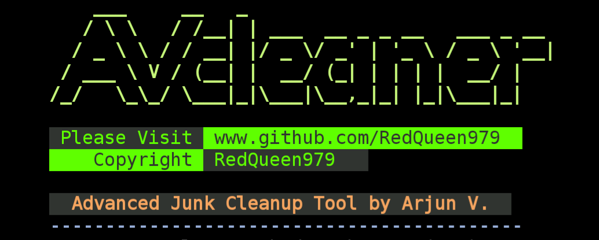

<p align="center">
<a href="https://github.com/RedQueen979"></a>
</p>

<p align="center">
<a href="https://github.com/RedQueen979"></a>
</p>

<p align="center">
<a href="https://github.com/RedQueen979"></a>
<a href="https://github.com/RedQueen979"></a>
<a href="https://github.com/RedQueen979"></a>
</p>


## About Tool

AVcleaner is a powerful tool designed for advanced cleanup tasks in Termux, focusing on clearing cached packages, removing temporary files, and deleting unnecessary logs. It ensures a thorough cleanup without affecting your installed packages or essential data.
## Installation

```bash
apt install git
```
```bash
git clone https://github.com/RedQueen979/AVcleaner && cd AVcleaner && chmod +x AVcleaner.sh && ln -s ~/AVcleaner/AVcleaner.sh /data/data/com.termux/files/usr/bin/clean
```
All set! Now, type 'clean' to run the tool.

## Running Tests

To run the tool just type `clean` and hit enter.

The script will guide you through selective cleanup options, including cached packages, temporary files, and logs.


## Features

- #### Selective Cleanup:
Choose specific cleanup options tailored to your needs (cached packages, temporary files, logs).

- #### Detailed Logs:
The tool generates cleanup details in cleanup_log.txt.

## Notes
This tool caters to advanced users who seek a customizable cleanup process.

## Screenshots


## License
[](https://opensource.org/licenses/)
This project is licensed under the GNU General Public License v3.0.

